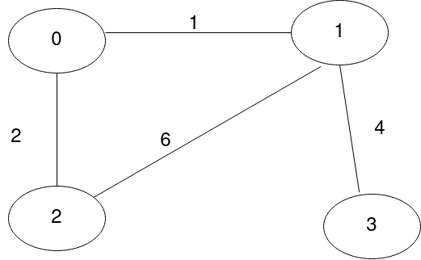
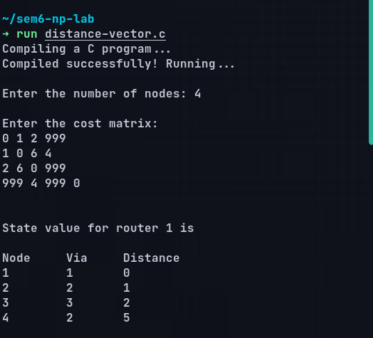
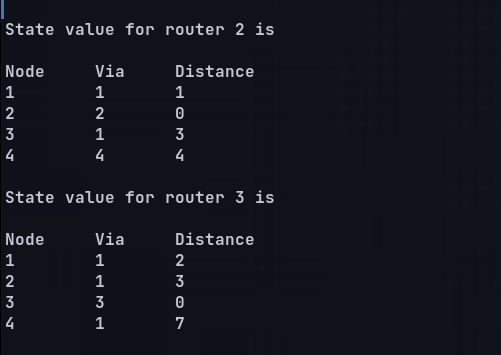
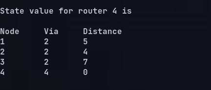
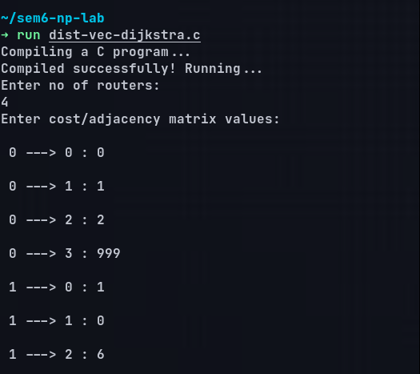
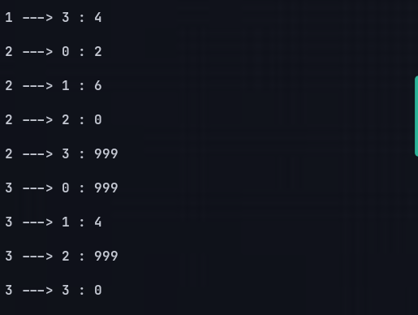
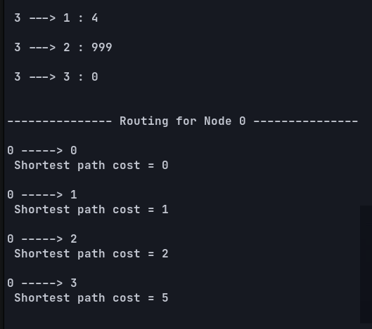
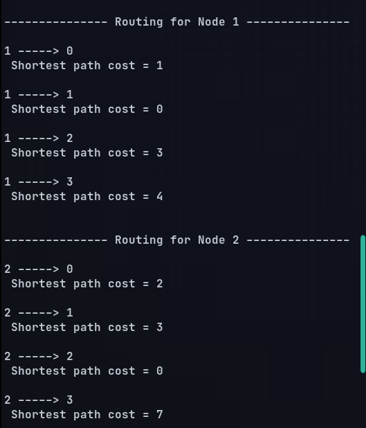
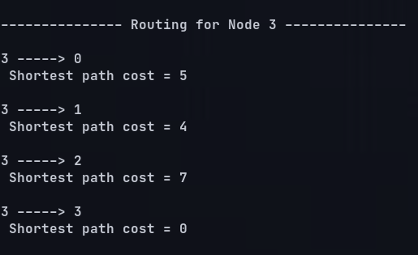

# Output Screenshots:

## Graph taken:

## Distance vector routing table using Bellman-Ford algorithm:

## Distance vector routing table using Dijkstra algorithm:

> Full Output is present in output text files
